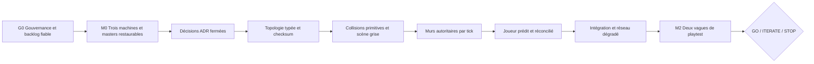

# Plan maître d’exécution — GAME

> Baseline de planification : `main` à `6b565f0`, vérifiée le 9 août 2026.
> Ce document pilote l’ordre et les gates. Les tickets prêts à copier dans GitHub sont dans
> [READY_BACKLOG.md](READY_BACKLOG.md).

Les lots ont aussi été prémâchés par pôle avec ownership de fichiers, API minimales et ordre de merge
dans [POLE_WORKPACKS.md](POLE_WORKPACKS.md). La rotation opérateur/témoin/approbateur est détaillée
dans [TEST_OWNERSHIP_MATRIX.md](TEST_OWNERSHIP_MATRIX.md).

## But du plan

Conduire le dépôt depuis le smoke test M0 actuel jusqu’à une décision de fun M2 sans étendre une
architecture réseau déjà identifiée comme provisoire. Le plan distingue :

- le travail qu’un assistant peut implémenter et documenter ;
- les décisions qui restent humaines ;
- les preuves qui exigent les Mac, le PC Windows ou plusieurs réseaux ;
- les travaux futurs qui ne deviennent réels qu’après une gate produit.

Les estimations sont des **jours de travail concentré** incluant implémentation, revue et preuve
locale. Elles ne sont pas des dates de livraison. Les attentes de comptes, d'installation, de
joueurs externes et de disponibilité ne sont pas comptées.

## Smoke anticipé — HT-00

Le chemin critique ci-dessous gouverne les validations réseau et les décisions de production, pas
le droit de vérifier tôt. HT-00 utilise le smoke test `maze` avec une personne, un hôte local et le
bot. Ses seuls prérequis sont un build praticable en mode `--human-test` et un log récupérable.

HT-00 vérifie déplacement, caméra, saut, une manipulation de labyrinthe et le punch du bot. Il ne
valide ni autorité, réseau distant, déterminisme, équilibre ni fun durable. Le verdict technique est
automatique et le parcours humain reste court : voir [la checklist](FIRST_HUMAN_TEST_DESIGN.md) et le
[runbook](FIRST_HUMAN_TEST_RUNBOOK.md).

## Vérité de départ

### Déjà acquis

- Unity `6000.3.20f1`, URP `17.3.0`, FishNet `4.7.2` et les packages sont figés.
- Un build Mac, deux instances locales et un roster à deux ont déjà fonctionné.
- La map 16x16, le personnage, les pivots et les murs mobiles forment un smoke test jouable.
- Les scripts Mac/Windows, les hooks, Git LFS et les contrôles statiques du dépôt existent.
- Le fournisseur du coffre est choisi : Cloudflare R2, bucket `ntw-assets`, préfixe `game/`.
- Le studio Blender compact et son contrat de production sont intégrés.

### Pas encore acquis

- Le dépôt GitHub est actuellement **public**, sans licence, `main` n’est pas protégé et les trois
  collaborateurs ont le rôle Admin. Les documents qui parlent encore d’un dépôt privé sont faux.
- Les issues GitHub `#1` à `#6` sont antérieures aux PR déjà mergées et ne décrivent plus l’état
  réel.
- Le second Mac, le build Windows IL2CPP et la session distante à trois n’ont pas de preuve finale.
- Le remote R2 est choisi, mais aucun master n’a encore été poussé puis restauré sur Mac et Windows.
- Deux masters originaux restent absents ; le master du personnage riggé n’existe que dans un
  workspace local ignoré.
- Les assemblies et wrappers EditMode/PlayMode existent localement ; leur exécution CI et leur
  reproduction Windows ne sont pas encore acquises.
- La topologie runtime v1 est versionnée/checksummée sur Mac ; la reproduction Windows et son
  branchement au futur snapshot réseau restent à prouver.
- Les colliders du décor dépendent encore en partie du FBX et de `MeshCollider`.
- Les murs et le joueur utilisent encore du temps local ou une autorité cliente.
- La boucle de manche, les métriques de playtest et les réglages joueur ne sont pas définis.

## Règle d’organisation

Chaque ticket important possède quatre responsabilités distinctes :

| Responsabilité | Rôle |
|---|---|
| pilote humain | tranche les décisions et accepte le résultat |
| exécutant | humain ou Codex ; produit la branche, les tests et la preuve |
| binôme humain | comprend réellement l’implémentation et la relit |
| testeur humain | suit la procédure sans avoir produit le lot |

Codex peut être l’exécutant principal, jamais le pilote produit ni le testeur indépendant de son
propre travail. Un lot réseau reste possédé par un humain même si l’essentiel du code est généré.

### Affinités de départ

| Personne | Responsabilité principale | Responsabilité secondaire |
|---|---|---|
| Zak | architecture réseau, simulation, validation Windows | règles/licences techniques |
| Sean | game/level design, lisibilité, assets et Unity visuel | conduite de playtest |
| Nils | produit, intégration, données/DVC et audio | cohérence technique et artistique |
| Codex | code, tests, outillage, CI, diagnostics et documentation | préparation Blender/Unity mesurable |

Nils reste l’intégrateur principal pendant M0/M1. Zak devient intégrateur de secours pour éviter un
point de blocage unique. Personne ne merge sa propre PR sans revue humaine quand elle touche un état
partagé, un asset source ou un réglage global.

## Chemin critique

Input Actions peut avancer en parallèle du modèle de murs. Le coffre, les preuves matérielles et la
gouvernance peuvent avancer pendant que Codex prépare les tests. La map 16x16, Wwise, Steam et le
contenu final ne sont jamais sur le chemin critique du duel gris.

Les flèches ci-dessus représentent les gates d’acceptation, pas une interdiction générale de
préparer du code réversible. Les types/parseur/checksum de `TOP-01`, le modèle de transition
paramétré et les Input Actions de base peuvent démarrer avant `DEC-01`; seules leurs constantes ou
politiques concrètes attendent la décision concernée. Le détail actualisé est dans
[AUDIT_CLOSURE_PLAN.md](AUDIT_CLOSURE_PLAN.md).

## Gates du programme

| Gate | Sortie obligatoire | Bloque |
|---|---|---|
| G0 — dépôt gouverné | visibilité/licence décidées, droits du contenu fermés, `main` protégé, droits réduits, backlog rebasé | toute diffusion plus large |
| G1 — M0 reproductible | second Mac propre, Windows IL2CPP, roster distant à trois, premier lot DVC restauré | refactor destructif et nouveaux masters |
| G2 — contrat logique | décisions ADR fermées, schéma/IDs/checksum, tests et colliders simples | réseau autoritaire |
| G3 — duel autoritaire | murs par tick, snapshot/late join, joueur prédit, même état Mac/Windows | playtest de fun |
| G4 — décision M2 | deux vagues, métriques, un seul sprint correctif, verdict écrit | art/contenu/Steam lourds |
| G5 — vertical slice | direction validée, audio, front-end minimal, Steam, budgets et profilage | production de contenu |
| G6 — alpha | boucle complète, contenu piloté par données, charge 2–12, QA continue | beta/release |
| G7 — release candidate | accessibilité, compatibilité, sécurité, licence, signature et distribution | publication |

## Plan de charge

| Horizon | Contenu | Effort indicatif | Réserve |
|---|---|---:|---:|
| G0 + M0 | gouvernance, issues, machines, réseau, DVC et masters | 4–8 j | dépend surtout des accès et machines |
| M1 / G2–G3 | tests, topologie, colliders, murs, joueur, intégration | 19–36 j | ajouter 30 % si FishNet impose une reprise |
| M2 / G4 | boucle minimale, UX, télémétrie, deux vagues et correction | 8–15 j | disponibilité des joueurs externe |
| M3 / G5 | vertical slice art/audio/Steam/performance | 20–40 j | seulement après `GO` |
| M4 / G6 | contenu, variantes, charge 2–12 et alpha | 35–70 j | dépend du volume de contenu choisi |
| M5 / G7 | beta, compatibilité, release et conformité | 20–45 j | dépend des plateformes promises |

Avec trois membres disponibles environ deux jours par semaine chacun, le verdict M2 est réaliste en
**6 à 10 semaines calendaires** si les accès arrivent immédiatement. À un jour par semaine et par
personne, prévoir plutôt **10 à 16 semaines**. Une date plus précise exige les disponibilités réelles.

## Séquençage opérationnel

### Vague 0 — remettre la vérité à niveau

Trois voies peuvent démarrer ensemble :

1. **Nils + Zak** : décision dépôt public/privé, licence, protection de `main`, droits GitHub et
   compatibilité Tailscale ; revue des droits avec Sean.
2. **Sean + Nils** : transmission des masters, premier lot DVC et preuve de sauvegarde.
3. **Codex + Zak** : correction de l’automatisation PR/Dependabot et fondation des tests Unity.

Sortie : G0, puis un backlog GitHub sans ticket déjà terminé ou mal placé.

### Vague 1 — fermer M0

- Sean valide l’ouverture propre du second Mac.
- Le propriétaire du PC, avec Zak, produit le build Windows IL2CPP.
- Zak orchestre la session distante ; les trois membres enregistrent la même preuve.
- Nils pousse le premier lot DVC ; Zak restaure sous Windows ; Sean confirme le contenu métier.

Ces tâches sont des validations matérielles. Codex prépare les commandes, analyse les logs et corrige
les scripts, mais ne peut pas signer la preuve à la place des machines.

### Vague 2 — construire la vérité logique

Ordre contraint :

1. fermer les décisions de l’ADR 0004 ;
2. reproduire sous Windows les assemblies de tests déjà vertes sur Mac ;
3. introduire le schéma v1 et la migration du JSON actuel ;
4. générer collisions et contrôles de connectivité depuis le schéma ;
5. livrer la scène grise à un pivot/deux spawns, sans FBX de gameplay.

Sean peut travailler sur la lisibilité du blockout pendant que Zak/Codex construisent le modèle, à
condition de ne pas modifier la source de collision ou le schéma partagé.

### Vague 3 — rendre le duel autoritaire

Ordre contraint :

1. modèle pur du mur et transition par tick ;
2. adaptateur FishNet, révisions, snapshot et arrivée tardive ;
3. Input Actions et capture d’une commande compacte ;
4. modèle pur du joueur ;
5. `Replicate`/`Reconcile` et correction réseau ;
6. interaction, effort/énergie et punch sous la même autorité ;
7. intégration de la map 16x16 comme test secondaire ;
8. matrice Mac/Windows, 30/60/120 FPS et réseau dégradé.

Les deux anciens systèmes de pivot ne deviennent pas deux architectures à maintenir : la migration
doit converger vers un seul modèle de mur autoritaire, puis retirer ou isoler clairement le smoke
test historique.

### Vague 4 — décider si le jeu mérite la suite

- définir une manche minimale et ses conditions de reset ;
- fournir HUD, sensibilité, FOV et commandes compréhensibles ;
- instrumenter les événements utiles sans conserver IP, voix ou identifiants de plateforme ;
- établir une baseline CPU/GPU/physique/mémoire sur le build réellement joué ;
- jouer une vague 1v1 ;
- autoriser au maximum un sprint correctif ;
- jouer une vague 2v2 ;
- écrire `GO`, `ITERATE` ou `STOP/PIVOT` avec les preuves.

Wwise peut être ouvert après G3, mais ne doit pas retarder la première vague. Des sons temporaires
Unity sont acceptables pour mesurer le duel.

## Travail conditionnel après `GO`

### M3 — vertical slice

- contrat artistique et budgets Unity par catégorie d’asset ;
- pivot, personnage et petit kit de couloir finalisables, avec LOD, UV, matériaux et imports prouvés ;
- Wwise sur Mac et Windows, sans voix de proximité ;
- `ConnectionTarget`, FishySteamworks et lobby entre deux comptes ;
- front-end minimal, reconnexion et états d’erreur ;
- captures CPU/GPU/mémoire sur le PC cible ;
- une petite expérience complète, pas encore douze joueurs ni plusieurs biomes.

Le pipeline 3D reste : master privé/DVC → projet studio textuel → travail `local_work/` → export
runtime Git LFS → import Unity exact → revue humaine. Les colliders gameplay restent produits par la
topologie, jamais par le mesh artistique.

### M4 — alpha

- variantes de labyrinthes générées depuis le schéma validé ;
- boucle complète incluant l’objectif retenu par M2 ;
- minimap, navigation et propagation sonore consommant la même topologie ;
- montée progressive 2 → 4 → 8 → 12 connexions avec budgets réseau ;
- interest management uniquement lorsqu’une mesure le justifie ;
- contenu et réglages pilotés par données, validateurs et migrations ;
- tests de non-régression, sauvegarde des masters et profilage continu.

### M5 — beta et release

- matrice matérielle Windows, pilotes GPU, résolutions et périphériques ;
- accessibilité, remapping, lisibilité couleur, localisation si promise ;
- sécurité du protocole, abus RPC, rate limiting et politique de données ;
- licence de chaque asset/package, mentions et contrats de distribution ;
- build release, signature, Steam depot, branches, crash reporting et rollback ;
- QA externe, triage, release candidate puis décision de publication.

Serveur dédié, matchmaking, anti-cheat lourd, voix de proximité et consoles restent des décisions de
produit séparées. Ils ne sont pas implicites dans “multijoueur”.

## Limites de travail en parallèle

- Deux PR d’implémentation maximum simultanément, plus une validation matérielle.
- Une seule PR touche `Packages`, `ProjectSettings`, une scène partagée ou un prefab racine.
- Le schéma, les migrations et les données utilisent une PR dédiée.
- Un lot DVC possède un seul éditeur et un claim daté.
- Une PR réseau ne mélange pas une mise à jour FishNet avec une feature gameplay.
- Une PR art ne change ni la collision autoritaire ni les IDs.
- Une PR reste idéalement sous deux à quatre jours ; au-delà, elle est redécoupée.

## Décisions humaines à fermer avant l’implémentation concernée

| Décision | Pilote | Bloque |
|---|---|---|
| dépôt public ou privé et licence associée | Nils + Zak | G0 et diffusion |
| rôles GitHub et règle de merge | Nils | G0 |
| plan Tailscale compatible avec le projet | Zak + Nils | playtests structurés |
| taux de tick et relation avec la physique | Zak | murs et joueur |
| hauteur/gabarit canonique du joueur | Sean + Zak | colliders et moteur joueur |
| saut durable ou outil provisoire | Sean + Nils | Input Actions et mouvement |
| conséquence d’un mur qui rencontre un joueur | Sean + Zak | simulation du mur |
| garantie de connectivité après mouvement d’un mur | Sean + Zak | TOP-02 et validation des softlocks |
| énergie, contestation et tie-break au même tick | Sean + Nils | interaction autoritaire INT-01 |
| condition minimale de victoire/reset M2 | Nils + Sean | boucle de manche |
| mode de licence/runner Unity CI | Nils + Zak | build CI |
| budgets art mesurables par catégorie | Sean + Nils | vertical slice |

Codex peut produire pour chaque décision une note d’options et de conséquences. Une valeur inconnue
reste `unresolved` ; elle n’est pas cachée dans une constante de code.

## Indicateurs de pilotage

À la fin de chaque semaine, suivre uniquement :

- gates vertes/rouges et preuve manquante ;
- PR ouvertes, âge et propriétaire ;
- tests déterministes passés/échoués ;
- divergences de checksum, tick ou révision ;
- build Mac et Windows au même commit ;
- masters récupérables/non récupérables ;
- incidents réseau bloquants par session ;
- après M2 seulement : compréhension, usage tactique, plaisir et envie de rejouer.

Le volume de code, de commits, d’assets ou de lore n’est pas un indicateur d’avancement.

## Politique de changement du plan

- Un ticket peut être redécoupé sans ADR s’il ne change ni une gate ni une source de vérité.
- Une dépendance, une autorité réseau, un format de données ou une plateforme change via ADR.
- Une estimation peut évoluer après le premier test, avec la cause notée.
- Après M2, tout horizon M3–M5 est replanifié à partir du verdict réel ; ce document ne vaut pas
  engagement de production avant `GO`.
